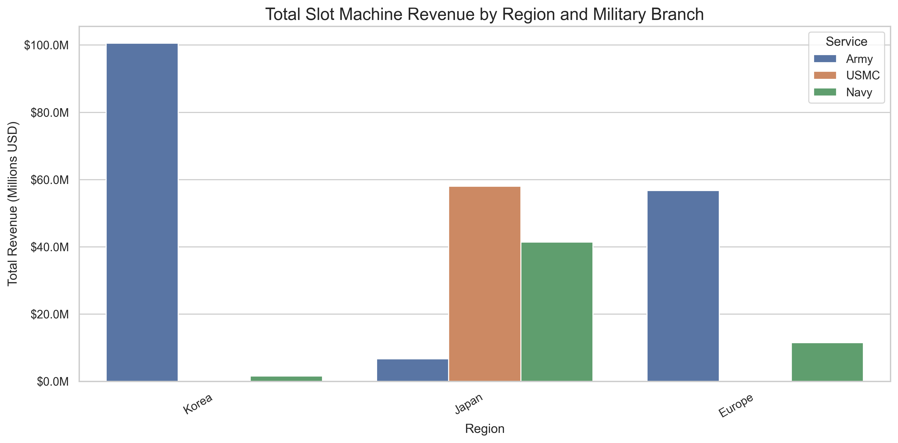
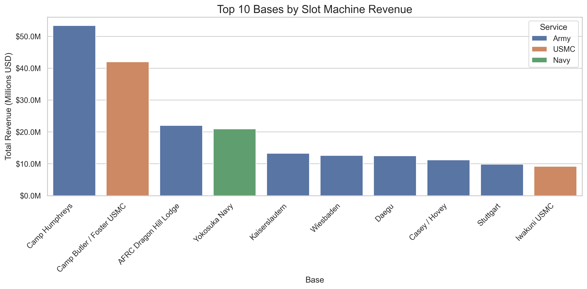
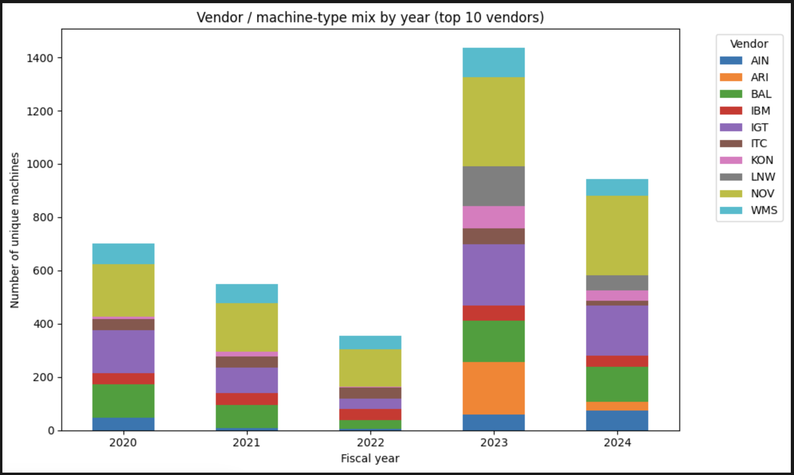
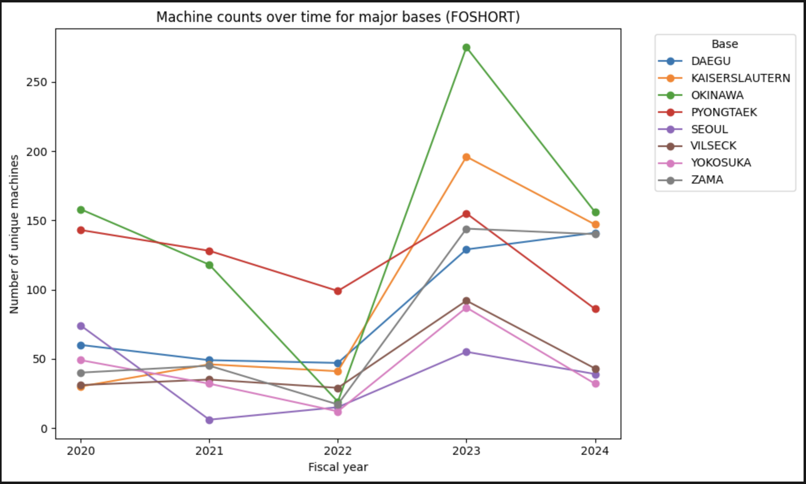

<h1 align="center">
  <br>
  <a href="https://www.bu.edu/spark/" target="_blank"></a>
  <br>
  MuckRock: US Military Base Slot Machine Revenue Explorer
  <br>
</h1>

<h4 align="center">Analyzing U.S. Military Slot Machine Revenues and Gambling Risks Across Overseas Bases</h4>

<p align="center">
  <a href="#overview">Overview</a> •
  <a href="#project-description-and-objectives">Project Description and Objectives</a> •
  <a href="#datasette-ui-showcase">Datasette UI Showcase</a> •
  <a href="#data">Data</a> •
  <a href="#repository-structure">Repository Structure</a> •
  <a href="#explotary-data-analysis">Explotary Data Analysis</a> •
  <a href="#where-to-start">Where to start</a> •
  <a href="#environment-setup">Environment Setup</a>
</p>


## Overview

The Data Liberation Project, run by MuckRock, is an initiative to **identify, obtain, reformat, clean, document, publish, and disseminate government datasets of public interest**.

This repository contains the code, analyses, and documentation produced by **Team B** for the **Fall 2025 (FA25)** offering of Boston University's **DS 701: Tools for Data Science (Spark!)**. The goal of the course project is to assist the MuckRock team by investigating publicly available datasets, building tools to clean and analyze the data, and preparing documentation so that future volunteers can easily reproduce and extend the work.

---

## Project Description and Objectives

This project was assigned by the MuckRock Foundation in collaboration with BU Spark! to provide students with hands-on experience in data acquisition, cleaning, and analysis for public good.

The Team B mission in FA25 is to:

1. Extracted all the data from PDF files provided by MuckRock to csv files.

2. Perform exploratory analysis to understand the structure, completeness, and potential insights in the data.

3. Build repeatable python scripts to clean and harmonize the data for downstream use.

4. Document the dataset thoroughly using GitHub.

5. Create a Datasette user interface for the future users to work on it. With the features such as: SQL query, chart, dashboard, map...etc. 

6. Summarize findings and deliver an organized codebase that future teams can build upon.

7. Answer base questions.

### Base Questions

#### 1. What is the total and per‑base slot machine revenue by military branch and by region?
Below is the total slot machine revenue by military branch and by region

| Military Branch | Region | # Bases | Total Slot Revenue | Per‑Base Slot Revenue |
| --------------- | ------ | ------- | ------------------ | --------------------- |
| Army            | Europe | 12      | $56,722,390        | $4,726,866            |
| Army            | Japan  | 2       | $6,701,208         | $3,350,604            |
| Army            | Korea  | 5       | $100,568,956       | $20,113,791           |
| Navy            | Europe | 4       | $11,521,089        | $2,880,272            |
| Navy            | Japan  | 6       | $41,435,211        | $6,905,868            |
| Navy            | Korea  | 1       | $1,599,465         | $1,599,465            |
| USMC            | Japan  | 7       | $58,054,966        | $8,293,567            |
                            

This table is the summary of total slot machine revenue by military branch and by region.




- This compares the total slot‑machine revenue for the Army (blue), Marine Corps (orange) and Navy (green) across three regions: Korea, Japan and Europe. The y‑axis measures total revenue in millions of U.S. dollars. Key observations include:  

  Army in Korea: five Army bases in Korea generate roughly $100 million, dwarfing all other branch/region combinations and making the Army in Korea the largest revenue driver.
  Japan: Marine Corps and Navy activities in Japan bring in around $58 million and $41 million respectively, while the Army’s two bases there contribute a modest $7 million.
  Europe: the Army’s 12 bases collect about $57 million, and Navy bases about $15 million; the Marine Corps does not operate slot machines in Europe.
  The call‑outs on the right summarise these points: the Army in Korea is the biggest contributor, and Marine Corps slot‑machine revenue is confined to Japan.




- The second slide ranks the top 10 individual bases by total slot‑machine revenue. The bases are colour‑coded by service branch (blue = Army, orange = Marine Corps, green = Navy). Notable findings:

  Camp Humphreys (Army) is the single highest‑earning base at over $50 million.
  Camp Butler / Foster (Marine Corps) follows at about $41 million.
  Other high‑earning Army bases include AFRC Dragon Hill Lodge, Kaiserslautern, Wiesbaden, Daegu, Casey/Hovey and Stuttgart, each ranging from roughly $10 million to $22 million.
  The Navy’s major contributor in this list is Yokosuka (around $21 million), and the Marine Corps’ Iwakuni base rounds out the top ten at about $10 million.
  Annotations emphasize that seven out of the ten top‑earning bases belong to the Army and that revenue is heavily concentrated among a few installations.


##### Answer for Base Question 1:

For Base Question 1, the charts show that the Army in Korea is the dominant source of slot-machine revenue, with about $100M generated across five bases (roughly $20M per base on average), making it both the largest branch–region total and the highest per-base earner. In Japan, Marine Corps bases collectively bring in around $58M (7 bases, ~$8M per base) and Navy bases about $41M (6 bases, ~$7M per base), while the Army’s two Japanese bases contribute a much smaller $7M total. In Europe, the Army’s 12 bases generate roughly $57M (about $5M per base) and the Navy’s European sites about $15M; the Marine Corps has no European slot-machine revenue. The per-base ranking mirrors this pattern: Camp Humphreys (Army, Korea) is the top individual base at over $50M, followed by Camp Butler / Foster USMC (Japan) at about $41M, and then a mix of high-earning Army and Navy bases such as AFRC Dragon Hill Lodge, Yokosuka Navy, Kaiserslautern, Wiesbaden, Daegu, Casey/Hovey, Stuttgart and Iwakuni. Overall, Army installations—especially in Korea—dominate both total and per-base revenue, and seven of the top ten bases by revenue belong to the Army, indicating that slot-machine income is highly concentrated in a small set of large overseas hubs.


#### 2. Which bases generate the highest total revenue, and how does that rank change by year and by branch?


- This figure compares the top five overseas bases by annual slot-machine revenue for the Army, Navy, and Marine Corps from FY2020 to FY2024. For the Army, Camp Humphreys (Korea) is consistently the top-earning installation, rising from about $12–15M between FY2020 and FY2023 before a sharp drop in FY2024. The Navy’s clear leader is Yokosuka Navy Base (Japan), which grows from roughly $5–10M through FY2023 and then also declines in FY2024, while Sasebo and the other Japan/Europe bases stay in the mid-single-million range. For the Marine Corps, Camp Butler / Foster (Japan) dominates its branch and is the single largest revenue-generating base in the dataset, increasing from about $14M to nearly $18M by FY2023 before falling back in FY2024. Overall, the chart shows that a small number of large Japanese and Korean hubs account for the majority of revenue in each branch, with strong growth up to FY2023 followed by a broad pullback in FY2024.


- This chart tracks the annual slot-machine revenue from FY2020 to FY2024 for every base that ever ranked in the overall top 10. It highlights how a small set of large overseas hubs account for most of the revenue across all branches. Camp Butler / Foster USMC (Japan) is the clear top performer, rising from about $13.8M in FY2020 to roughly $18M in FY2023 before dropping sharply in FY2024. Camp Humphreys (Army – Korea) is consistently the second-highest base, with steady growth from around $12.6M to $15M over FY2020–FY2023 and a similar pullback in FY2024. A second tier of bases—including Yokosuka Navy (Japan) and Wiesbaden (Army – Europe)—shows moderate growth into the $8–10M range by FY2023, while mid-tier sites such as AFRC Dragon Hill Lodge, Iwakuni, Sasebo, Kaiserslautern, and others peak around $3–5M. All bases experience a noticeable revenue decline in FY2024, but the relative ordering between bases and branches remains largely unchanged.


##### Answer to Base Question 2

Across FY2020–FY2024, the highest-revenue base in the entire dataset is Camp Butler / Foster USMC (Japan), which consistently ranks #1 overall and within the Marine Corps, followed by Camp Humphreys (Army – Korea) as the steady #2 base and top Army site, and Yokosuka Navy (Japan) as the leading Navy base that generally sits in the #3 overall position. A second tier of Army and Navy installations—such as Wiesbaden (Europe), AFRC Dragon Hill Lodge and Casey/Hovey/Daegu (Korea), Iwakuni USMC, Sasebo and Atsugi Navy, Kaiserslautern and Stuttgart—contributes substantially but never surpasses these three leaders. While revenues for most top bases rise from FY2020 to FY2023 and then drop sharply in FY2024, this volatility mainly affects the magnitude of revenue rather than the ordering, so the cross-branch ranking of the top-earning bases remains remarkably stable over time.


#### 3. How have the total number of slot machines and the vendors at major bases changed over time?


- Total unique machines by year
The first chart shows the total number of unique slot machines across all bases for each fiscal year from 2020 to 2024.
Overall machine counts decline steadily from around 800 machines in 2020 to roughly 600 in 2021 and 400 in 2022.
There is then a sharp expansion in FY2023, when the inventory jumps to about 1,600 machines—roughly double the 2020 level.
In FY2024, the fleet contracts again to a little over 1,000 machines, but remains well above the pre-2023 levels, suggesting a partial pullback rather than a full reversal of the 2023 build-up.





- Vendor / machine-type mix by year (top 10 vendors)
The second stacked bar chart breaks down the annual machine counts by vendor (top 10 vendors only).
From 2020–2022, total machine counts are relatively modest, and the mix is dominated by a few key vendors such as NOV and IGT, with smaller contributions from others like IBM, WMS, and a handful of additional suppliers.
In 2023, the total number of machines increases dramatically, and the growth is broad-based: nearly all vendors add machines, with particularly large expansions from NOV, IGT, and newer or previously smaller vendors such as ARI and LNW.
By 2024, the total number of machines declines from the 2023 peak, and several vendors scale back, but NOV and IGT remain core contributors, indicating a more concentrated vendor landscape after the post-2023 adjustment.





- Machine counts over time for major bases (FOSHORT)
    For this analysis, “major bases” are defined as the eight installations with the highest total number of unique machines across FY2020–FY2024.
  The third chart tracks machine counts over time for eight major bases: DAEGU, KAISERSLAUTERN, OKINAWA, PYONGTAEK, SEOUL, VILSECK, YOKOSUKA, and ZAMA.
  Many bases experience declining or flat machine counts between 2020 and 2022—for example, OKINAWA and PYONGTAEK both trend downward over this period, and SEOUL drops sharply between 2020 and 2021.
  In 2023, there is a pronounced expansion across almost all major bases: OKINAWA, KAISERSLAUTERN, DAEGU, and ZAMA all show large spikes in machine counts, and smaller bases such as YOKOSUKA, VILSECK, and SEOUL also rebound.
  By 2024, machine counts fall back from the 2023 highs at most bases, but in many cases (e.g., DAEGU, KAISERSLAUTERN, OKINAWA) they remain above their 2022 levels, suggesting a net increase in machine presence compared with the earlier years.


##### Answer for Base Question 3

Across FY2020–FY2024, the slot-machine footprint at the bases follows a “dip, surge, then partial normalization” pattern. Total machine counts decrease from 2020 through 2022, then surge in 2023 and remain elevated in 2024 relative to pre-2023 levels (Figure 1). The vendor mix evolves alongside this expansion: early years are dominated by a few suppliers (especially NOV and IGT), but the 2023 build-out is broad-based, with many vendors adding machines, and then consolidates again in 2024 with NOV and IGT still playing leading roles (Figure 2). At the base level, most major installations reduce or hold machine counts flat through 2022, then significantly increase their inventories in 2023 before trimming back in 2024, typically to levels still higher than in 2022 (Figure 3). Taken together, the data suggest that bases went through a period of contraction, followed by an aggressive expansion in both machine numbers and vendor diversity in 2023, and then a selective pullback that preserves a higher baseline of machines and a somewhat more concentrated set of core vendors.


---
## Datasette UI Showcase

Click the following thumbnail image to see the initial demo video:

[](https://youtu.be/jmPjwh6bLL4)

---

## Slot Machine Revenue Dashboard (FY2020–FY2024)

This dashboard provides an interactive overview of U.S. military slot-machine revenue across Army, Navy, and Marine Corps installations worldwide from FY2020 to FY2024.
It visualizes key metrics such as total revenue, monthly trends, fiscal-year patterns, branch–district comparisons, top-earning installations, and geospatial distributions.

Users can filter by fiscal year, branch, and district to explore different perspectives of the data.

### Live Dashboard

[https://ds-701-muckrock-data-liberation-project.onrender.com/dashboards](https://ds-701-muckrock-data-liberation-project.onrender.com/-/dashboards)

### About the Data

All tables were reconstructed from multi-year PDF revenue reports using custom parsers, then cleaned, standardized, and enriched with geospatial coordinates. The processed datasets are published to Datasette and rendered through the datasette-dashboards and datasette-cluster-map plugins.

### Features

- Interactive global installations map  
- Total revenue summary  
- Revenue by month and fiscal year  
- Branch vs. district heatmap  
- Top 10 installations by revenue  
- Branch revenue share visualization 

---

## Data

This project focuses on liberating and structuring several key ARMP datasets, including slot machine 
- Asset Reports (FY2020, FY2021, FY2022, FY2023, FY2024)
- Marine revenue
- Navy revenue
- District revenues
- Financial Statement
- Revenue Comparison

These cleaned tables power downstream analysis and public-facing tools like Datasette.
For a detailed, table-by-table description of our extraction pipelines and outputs, see fa25-team-b-dev/PDF Extraction/readme.md,
which documents the asset, marine, navy, district revenue, and revenue comparison workflows.

## Repository Structure

The repository is organized to make it easy for others to pick up where this team leaves off. Below is a high–level description of the actual structure. If any folders or files mentioned below are missing or renamed in your local copy, please update this README accordingly.

| Path (relative to repo root)                            | Purpose                                                                                                                                                        |
| -------------------------------------------------------- | -------------------------------------------------------------------------------------------------------------------------------------------------------------- |
| `fa25-team-b-dev/fa25-team-b/`                          | All work for the FA25 Team B development effort. Inside this folder you should find notebooks, scripts, and data used for our analyses.                       |
| `fa25-team-b-dev/fa25-team-b/eda/`                      | Early explorations and exploratory data analysis (EDA). Each notebook should have a descriptive filename and include clear markdown explaining its purpose.   |
| `fa25-team-b-dev/fa25-team-b/PDF Extraction/`           | Python scripts and notebooks for cleaning and processing data from PDF files into CSV files (e.g., Asset, Marine, Navy, District, Revenue Comparison, etc.). |

## Explotary Data Analysis

This section presents the Exploratory Data Analysis (EDA) of our dataset. The analysis covers financial statements, asset distributions, revenue patterns, and operational trends across multiple fiscal years (FY2016–FY2024). 
### 1. Geographic Patterns
| Category               | Key Insights                                                                 |
|------------------------|-------------------------------------------------------------------------------|
| Asia-Pacific Dominance | Japan and Korea installations generate over 70% of total ARMP revenue         |
| Japan's Central Role   | Highest revenues across all service branches; top performer for Navy & USMC  |
| Europe’s Significance  | Holds the largest EGM share (39.4%); strongest Army operational presence     |

### 2. Service Branch Patterns
| Category               | Key Insights                                                                 |
|------------------------|-------------------------------------------------------------------------------|
| Army Dominance         | Operates 55.7% of all EGMs; generates ~60% of global revenue                 |
| Marine Corps Focus     | Highest per-base revenue; heavily concentrated in Japan                      |
| Navy Distribution      | Strong presence in Japan (Yokosuka, Sasebo); moderate operations in Europe   |

### 3. Temporal Trends
| Category          | Key Insights                                                                     |
|-------------------|-----------------------------------------------------------------------------------|
| COVID-19 Impact   | Sharp revenue decline in FY2020 across all service branches                      |
| Recovery Pattern  | Gradual revenue recovery from FY2021 to FY2023                                   |
| FY2024 Decline    | Decline due to incomplete fiscal year data, not true operational downturn        |
| Seasonal Patterns | March and May consistently show revenue peaks                                    |

### 4. Financial Health Concerns
| Category               | Key Insights                                                                 |
|------------------------|-------------------------------------------------------------------------------|
| Restricted Cash        | Restricted cash reserves fully depleted by 2023                              |
| Static Equity          | Total equity unchanged since Oct 2021 (possible reporting issue)             |
| Asset Aging            | Machine inventory aging; depreciation trends require further attention       |

For more details about the EDA, please refer to the following link:
[Go to EDA README](eda/README.md)

## Where to start

If you’re new to this repo and just want to understand what we did, start here:

#### 1. Early insights & EDA

If you want to see **early insights and sanity checks on the extracted data** (distributions, basic trends, data quality):

- `fa25-team-b-dev/fa25-team-b/eda/<THE_EDA_YOUWANT>.ipynb`  
  – High-level exploratory analysis on the cleaned revenue tables (e.g. summary stats by base, fiscal year, branch).


#### 2. PDF → CSV extraction pipelines

If you want to understand **how raw PDFs are turned into structured CSVs**：

- `fa25-team-b-dev/fa25-team-b/PDF Extraction/FY2021_Asset_Report_Extraction.ipynb`  
  – End-to-end extraction of the FY2021 Asset Report into standardized tables (summary + detail CSVs, with cleaning and column standardization).

- `fa25-team-b-dev/fa25-team-b/PDF Extraction/Marine_Revenue_FY20_FY24.ipynb`  
  – Extracts and cleans the Marine revenue report (FY20–FY24) into CSVs capturing game counts, handle, revenue, and per-base metrics.

- `fa25-team-b-dev/fa25-team-b/PDF Extraction/District_Revenues_FY20_FY24.ipynb`  
  – PyMuPDF-based extraction for the District Revenues FY20–FY24 PDF, including logic to handle multi-line rows and header parsing.

#### 3. Detailed dataset documentation

For **details, extraction logic, and data dictionaries**, please refer to 
[PDF Extraction README](PDF-Extraction/readme.md):

- `fa25-team-b-dev/fa25-team-b/PDF Extraction/README.md`  
  – Describes what each PDF source contains, how we parsed it (e.g. `pdftotext`, `pdfplumber`, `PyMuPDF`), what CSVs are produced, and what each column means.

---

## Environment Setup

To reproduce the analyses or run the code yourself, follow these steps. Replace any placeholders with the actual commands or file names once they are finalized.

### 1. Clone the repository

```bash
git clone <repository_url>
cd MuckRock_project
```

### 2. Create a virtual environment

We recommend using either conda or Python’s built-in venv to manage dependencies.

Using conda:

```bash
conda create -n muckrock-fa2025 python=3.10
conda activate muckrock-fa2025
```

Using venv (alternative):

```bash
python -m venv .venv
source .venv/bin/activate   # on macOS/Linux
# .venv\Scripts\activate    # on Windows
```


### 3. Install dependencies

A requirements.txt or environment.yml file should list all Python packages needed to run the scripts and notebooks. If this file does not yet exist, please generate one by exporting your environment or writing down the packages you installed.

```bash
# via requirements.txt (update the filename/path if different)
pip install -r ds-muckrock-liberation/fa25-team-b-dev/PDF Extraction/requirements.txt
```

### 4. Configure data paths

Some notebooks may reference data stored on Google Drive. Before running those notebooks, make sure you have access to the data and update any hard-coded file paths.

You may provide a .env.example file to illustrate how to supply secrets (such as API keys) without committing them to Git. Users can then copy it to .env and fill in their own values.


Drive link: https://drive.google.com/drive/folders/1CZ0JF2y9IhaPy-KH4tkH2YbJyr750urc?usp=drive_link


### 5. Run notebooks and scripts

Use JupyterLab, VS Code, or your preferred IDE to explore the notebooks in the notebooks/ folder.

Best practices:

Clear all outputs before committing changes.

Ensure each notebook runs top-to-bottom without errors.

If a notebook is meant to be run as a script, indicate that clearly at the top in markdown.

### 6. Contributing workflow

All development should occur on branches off of dev (or the main development branch specified by your PM/TPM). After making changes:

Commit and push your branch:
```bash
git add .
git commit -m "Describe your change"
git push origin <your-branch-name>
```

Then:

Open a Pull Request targeting the dev branch.

Request reviews from your PM/TPM.

Open a final Pull Request from dev to main.
